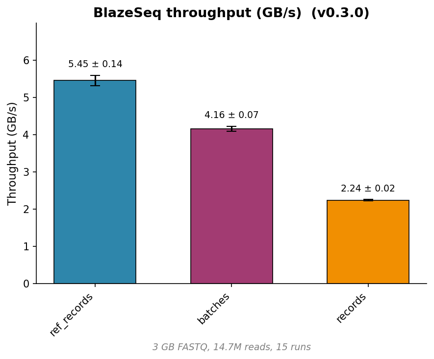

# 🔥 BlazeSeq

**High-Performance FASTX Parsing for Mojo — Zero-Copy to GPU**

[](https://github.com/MoSafi2/BlazeSeq/actions/workflows/run-tests.yml)
[](https://github.com/MoSafi2/BlazeSeq/actions/workflows/docs.yml)
[](https://mosafi2.github.io/BlazeSeq/)
[](https://docs.modular.com)
[](LICENSE)

A high-throughput **FASTQ** parser written in [Mojo](https://docs.modular.com/mojo/). BlazeSeq targets several GB/s throughput from disk using zero-copy parsing, with owned records and GPU-friendly batching for read pipelines. It also supports streaming **FASTA** and samtools-style **`.fai`** index files (five- or six-column rows from `faidx`, index metadata only). **Multithreaded** gzip decompression uses **rapidgzip** ([rapidgzip](https://github.com/mxmlnkn/rapidgzip)). Configurable validation is available — all through a single unified API.

## ✨ Key Features

- **SIMD-accelerated scanning** — Vectorized from the ground up using mojo SIMD first-class support.
- **Three parsing modes** — Choose your trade-off between speed and convenience:
  - `views()` — Zero-copy views (fastest, borrow semantics)
  - `records()` — Owned records (thread-safe)
  - `batches()` — Structure-of-Arrays for GPU upload
- **Compile-time validation toggles** — Enable/Disable ASCII/quality-range checks at compile time for maximum throughput
- **Rapidgzip with parallel decoding** — Gzipped FASTQ (`.fastq.gz`) is decompressed in parallel across multiple threads for high throughput; tune with the `parallelism`.
- **FASTA and FAI** — Streaming FASTA parsing and `.fai` index files; see the API reference for `FastaParser` and `FaiParser`.



## Quick Start

### Mojo package from repo (Pixi)

Use BlazeSeq as a Mojo dependency in your project. Install [pixi](https://prefix.dev/docs/pixi/) first, then add BlazeSeq to your `pixi.toml`:

```toml
[dependencies]
blazeseq = { git = "https://github.com/MoSafi2/BlazeSeq", branch = "main" }
```

Then run `pixi install` and use the full Mojo API (e.g. `FastqParser`, `FastaParser`, `FaiParser`, `views()`, `batches()`, GPU batching).

## Python bindings (experimental)

Python bindings are available via a wheel-only package on PyPI. They are **experimental** and may change. Install with `pip install blazeseq` or `uv pip install blazeseq`. Usage and API are documented in [python/README.md](python/README.md).

### 🛠 Usage examples

```sh
# FastqParser with and without validation
pixi run mojo run examples/example_parser.mojo /path/to/file.fastq

# GPU needleman-wunsch global alignment (requires GPU)
pixi run mojo run examples/nw_gpu/main.mojo
```

### Count reads and base pairs

```mojo
from blazeseq import FastqParser, FileReader
from pathlib import Path

def main() raises:
    var parser = FastqParser(FileReader(Path("data.fastq")), "sanger")
    var reads = 0
    var bases = 0
    for record in parser.records():
        reads += 1
        bases += len(record)
    print(reads, bases)
```

### Maximum speed (validation off)

```mojo
from blazeseq import FastqParser, ParserConfig, FileReader
from pathlib import Path

def main() raises:
    comptime config = ParserConfig(check_ascii=False, check_quality=False)
    var parser = FastqParser[config=config](FileReader(Path("data.fastq")), "generic")
    for view in parser.views():   # zero-copy
        _ = len(view)
```

### Batched (for GPU pipelines)

```mojo
from blazeseq import FastqBatch
from gpu.host import DeviceContext

var ctx = DeviceContext()
var parser = FastqParser(FileReader(Path("data.fastq")), schema="generic", batch_size=4096)
for batch in parser.batches():
    # batch is a FastqBatch (Structure-of-Arrays)
    var device_batch = batch.to_device(ctx)   # GPU upload
    # Your GPU kernel, check examples
```

### Reading gzip (rapidgzip, parallel decoding)

BlazeSeq uses **RapidgzipReader** for gzipped FASTQ. It performs **parallel decompression**: the compressed stream is split into chunks and multiple threads decode them concurrently resulting in much higher throughput than single-threaded readers through `zlib` or `libdeflate` .

```mojo
from blazeseq import RapidgzipReader, FastqParser

var reader = RapidgzipReader("data.fastq.gz", parallelism=4)  # 0 = use all available cores.
var parser = FastqParser(reader^, "illumina_1.8")
for record in parser.records():
    _ = record.id()
```

## Architecture & Trade-offs

| Mode                           | Return Type        | Copies Data? | Use When                                                           |
| ------------------------------ | ------------------ | ------------ | ------------------------------------------------------------------ |
| `next_view()` / `views()`      | `FastqView`        | **No**       | Streaming transforms (QC, filtering) where you process and discard. Not thread-safe |
| `next_record()` / `records()`  | `FastqRecord`      | **Yes**      | Simple scripting, building in-memory collections       |
| `next_batch()` / `batches()`   | `FastqBatch` (SoA) | **Yes**      | GPU pipelines, parallel CPU operations                |

**Critical**: `FastqView` spans are only valid until the next parser operation. Do not store them in collections or use after iteration advances.

## Benchmarks

Throughput (file-based and in-memory) and comparison with needletail, seq_io, and kseq. See [benchmark/README.md](benchmark/README.md) for commands and details.

## Documentation

- API Reference: [https://mosafi2.github.io/BlazeSeq/](https://mosafi2.github.io/BlazeSeq/)
- The site is generated with [Modo](https://mlange-42.github.io/modo/) (plain markdown from `mojo doc` output) and [Astro Starlight](https://starlight.astro.build/).
- Examples: `examples/` directory includes parser usage, writer, and GPU alignment

## Limitations

- No multi-line FASTQ support — Records must fit four lines (standard Illumina/ONT format)
- No current support for Paired-end reads (in progress)
- No random seek within FASTQ/FASTA streams — sequence parsers are sequential; use `MemoryReader` for repeated scans. `.fai` index metadata is parsed separately with `FaiParser`.
- Python package is wheel-only (no source build of the extension on install)

## Testing

Run the test suite with pixi:

```bash
pixi run test
```

Tests use the same valid/invalid FASTQ corpus as [BioJava](https://github.com/biojava/biojava/tree/master/biojava-genome%2Fsrc%2Ftest%2Fresources%2Forg%2Fbiojava%2Fnbio%2Fgenome%2Fio%2Ffastq), [Biopython](https://biopython.org/), and [BioPerl](https://bioperl.org/) FASTQ parsers. Multi-line FASTQ is not supported.

## Project History

BlazeSeq is a ground-up rewrite of MojoFastTrim (archived [MojoFastTrim](https://github.com/MoSafi2/BlazeSeq/tree/MojoFastTrim)), redesigned for:

- Unified parser architecture (one parser, three modes)
- GPU-oriented batch types
- Compile-time configuration

## Acknowledgements

The parsing algorithm is inspired by the parsing approach of rust-based [needletail](https://github.com/onecodex/needletail). It was further optimized to use first-class SIMD support in mojo.

## License

This project is licensed under the MIT License.
